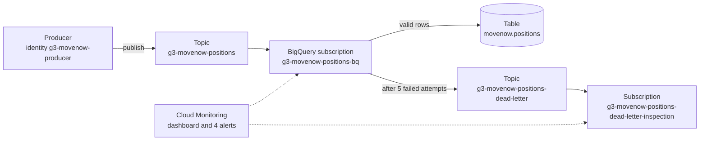
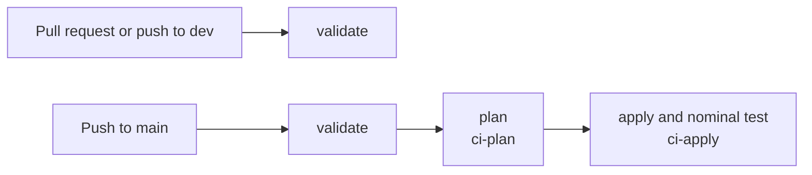

# Architecture

## Deployed resources

## Flows

1. **Publish.** The producer sends JSON to the topic. IAM checks it may publish there; Pub/Sub does
   not read the content. Messages stay in `europe-west9` and remain on the topic for 1 day, for
   replay.
2. **Deliver.** The subscription holds each message until it is acknowledged, for up to 7 days.
   Google's built-in writer inserts it into the table, as the Pub/Sub service agent.
3. **Validate.** BigQuery checks every field against the schema (types, required fields). A valid
   row is written and the message is acknowledged.
4. **Fail.** An invalid message is retried with a growing delay (10 s to 600 s). After 5 attempts,
   Pub/Sub moves it to the dead-letter topic. It waits 7 days in the inspection subscription.
5. **Watch.** Monitoring follows the backlog, the age of the oldest message, the export state and
   the dead letters.

## Identities

| Identity | Can do | Created by |
| --- | --- | --- |
| `g3-movenow-producer` | Publish to the positions topic only | bootstrap |
| Pub/Sub service agent | Write to the table, publish to the dead-letter topic, acknowledge on the subscription | Google; rights from `delivery` |
| `g3-movenow-ci-plan` | Read the project and the state; add new saved plans | bootstrap |
| `g3-movenow-ci-apply` | Manage Pub/Sub, BigQuery, Monitoring, APIs; only from `main` | bootstrap |

No service account key exists. People and the CI get short-lived credentials (impersonation,
workload identity federation).

## Key parameters

| Parameter | Value | Source |
| --- | --- | --- |
| Tolerated outage | 7 days (subscription retention) | Scoping |
| Replay window | 1 day (topic retention) | Scoping |
| Delivery attempts before dead letter | 5 | Minimum allowed |
| History in BigQuery | 7 days (partition expiration) | Scoping |
| Partitioning | One partition per day of `event_time` | Analysts query by event time |

## Three choices

**1. A BigQuery subscription, not our own consumer.**
Rejected: a Cloud Function or a Dataflow job reading the subscription and writing to BigQuery.
Gain: no code to write, deploy, scale or monitor; retries and dead letters are built in.
Cost: no transformation or deduplication before writing. Duplicates are handled at query time.

**2. Validation by the table schema when the row is written, not by a topic schema at publish.**
Rejected: a Pub/Sub schema on the topic, which refuses invalid messages at publish time.
Gain: an invalid message is kept in the dead letter, so it can be inspected, fixed and replayed.
Cost: invalid messages enter Pub/Sub, and the schema only checks types, not ranges: a latitude of
999 is accepted.

**3. A keyless CI with two identities.**
Rejected: one service account key stored as a GitHub secret.
Gain: nothing to leak or rotate. The plan identity is read-only; both identities are available
only from `main`, and only for this repository's numeric id.
Cost: a bootstrap to apply by hand. With a single environment there is no approval step: a push to
`main` is applied right after its plan.

## CI

